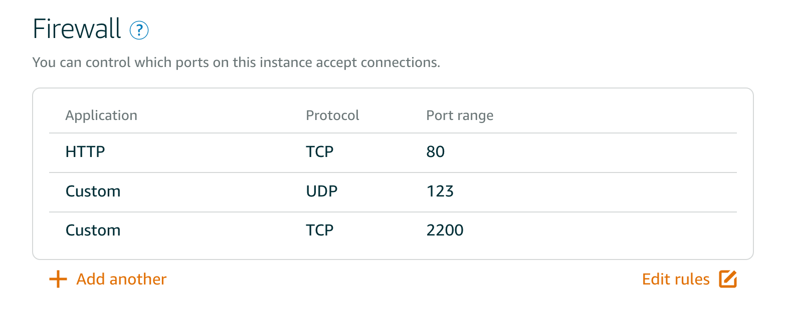

## Create new `grader` user and assign sudo permissions

*  ```sudo adduser grader```

* Add grader's sudo permissions into sudoer's file. Open  file `sudo visudo` and paste `grader ALL=(ALL:ALL) ALL` there right under `#User privilege specification`.

*  Add grader user to sudoers. Open  file `sudo nano /etc/sudoers.d/grader` and paste `grader ALL=(ALL:ALL) ALL` there.

*  Create `.ssh` directory for grader. `sudo mkdir /home/grader/.ssh` , copy content from `sudo vi /home/ubuntu/.ssh/authorized_keys` into `sudo vi /home/grader/.ssh/authorized_keys`

* Try to login via `ssh -i [keyFilename] grader@[ip-of-your-machine]"`


## Update the packages

 ```
sudo apt-get update
sudo apt-get upgrade
 ```

## Setting required firewall configurations

* Update port from `22` to `2200` in `/etc/ssh/sshd_config`.

* Update configurations to defaults via `sudo ufw default deny incoming`  and `sudo ufw default allow outgoing`

* Allowing connections for SSH (port 2200), HTTP (port 80), and NTP (port 123):
```
sudo ufw allow 2200/tcp
sudo ufw allow 80/tcp 
sudo ufw allow 123/udp
```
* Turn on the fw on `sudo ufw enable`.

* Check everything is set correct via `sudo ufw status`.

Set all the same int Amazon Lightsail:
1. Select your instance
2. Go to  `networking`
3. Set to following:

